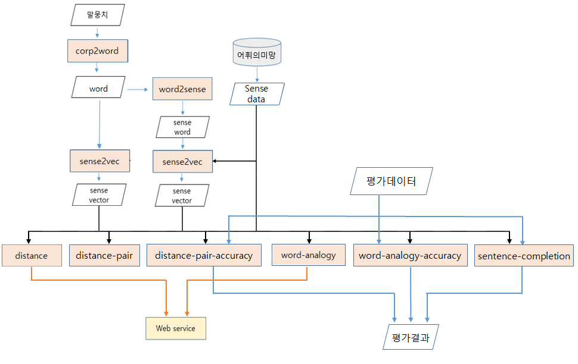

Sense-Embedding
========
딥 러닝 기반의 자연 언어 처리에서 가장 핵심이 되는 Word-Embedding의 성능을 향상 시키는 것을 목적으로 개발하였다. 어휘의미망(WordNet)을 이용하여 동일한 의미의 단어들을 Synset으로 묶은 Sense라는 개념을 도입하여 성능을 향상시키고, 평가하는 프로그램을 제공한다.
Contents
========
* [설치방법](#installation)
* [구조도](#structure)
* [사용법](#usage)

설치방법 
============
		git clone https://github.com/sukgiyeol/Sense-Embedding.git
		cd ./Sense-Embedding/src		make
Github에서 Sense-Embedding을 설치한 뒤 src 폴더로 이동 , Makefile을 실행시킨다.

구조도
=====

사용법
=====
